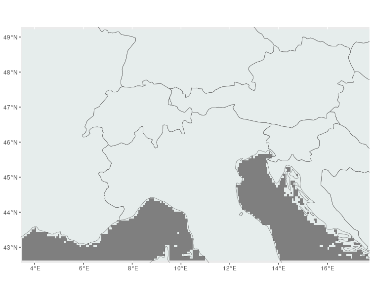
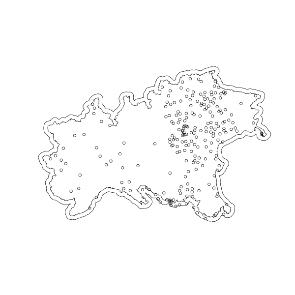
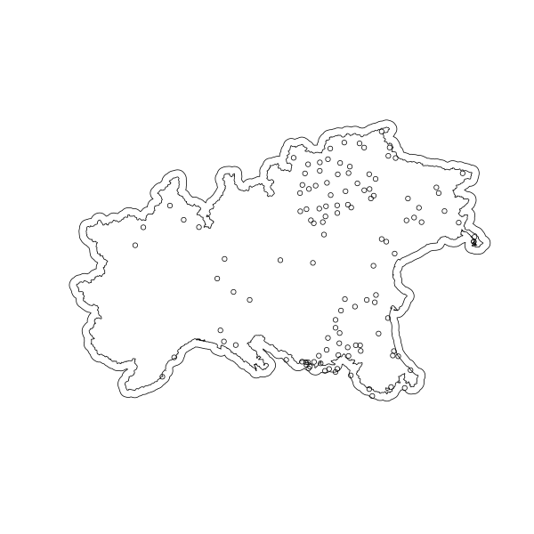

# spinla

R-INLA for SPI data fusion (observations + ERA5 reanalysis). 

The statistical model is described here:

[Data Fusion in a Two-stage Spatio-Temporal Model using the INLA-SPDE Approach](https://arxiv.org/abs/2207.10027)

## Input data

The data (monthly precipitation time series) cover the time period 1981 - 2021.

### Study Domain

| xmin | xmax | ymin | ymax |
|------|------|------|------|
| 3.431292 | 17.72012 | 42.55264 | 49.28426 |

### Station data

Two possible data sources for precipitation time series:

- [] marsMET (JRC)

- [X] SCIA (ISPRA) (**June 18th 2023: spi time series calculated using SCIA precipitation time series**)
  
- [NO] ARCIS: **data must be provided by the data owners, a single data source from which to retrieve the data is not available**

The following picture shows the spatial distribution for the SPI-3 time series (reference baseline 1991-2020). A buffer of 10km was used to detect the potential input stations. 

The following picture shows the spatial distribution for the SPI-3 time series (reference baseline 1981-2010).

### Gridded data

SPI gridded data based on ERA5. Data are provided by the European Drought Observatory.  

### Covariates (to be continued)

- [] **Indice di "stabilità" atmosferica mensile, per ogni punto: variance della 500hPa**

- [] **Indice di weather disturbances: per ogni punto usiamo un intorno di 200-300km e usiamo il max del gradiente di 500hpa oppure 850 hPa**

- [] **Indici di stabilità anticiclonica - variabilità Anticiclone Sub Tropicale**

  *Seguendo Davies et al., 1997 potremmo calcolare "the overall mean frequency and (b) standard deviation of days per half month with sea level pressure >1020 mb at each grid point" . Questo indice ci direbbe quando l'anticiclone si estende sull'area di interesse o anche nell'area più grande.*

- [] **StormTrack Atlantica - variabilità ciclonica**
  
*La ciclonicità è sicuramente connessa all'intensità e alla tipologia della precipitazione. Potremmo usare l'indice cosiddetto di storm track "... storm track intensity primarily using high-pass-filtered 300-hPa meridional velocity (henceforth referred to as υ′) variance", che tiene conto dell'intensità e la posizione-passaggio di strutture cicloniche ( Wallace et al, 1998, Chang and Fu, 2002).*

- [] **Instabilità convettiva atmosferica - propensione alla convezione**
  
*Esistono numerosi indici calcolabili da grandezze atmosferiche per identificare il potenziale convettivo di un determinato stato dell'atmosfera in una precisa località. Ma userei quelli semplificati, basati sulla temperatura. Uno interessante è il DeltaThetaEquivalente che misura la differenza di temperatura potenziale equivalente tra 2 strati dell'atmosfera, tra 500hPa e 850hPa. In pratica laddove questo gradiente è positivo si ha una inibizione della convezione,  mentre quando è positivo si ha una propensione. Ovviamente non è detto che dove ci sia propensione la convezione parta realmente. Ma comunque a scala più che mensile dovrebbe essere significativo il suo contributo magari dal cumulato della sua sola parte positiva.  Anche il campo delle fulminazioni funzionerebbe, ma sarebbe meno pratico da avere bello e pronto, al contrario del campo di DeltaThetaE.*

## SPI time series (ERA5)

- [x] SPI-3 (**June 18th 2023**). NOTE: the ERA5 SPI-3 has been generated by Guido from the hourly ERA5 precipitation datasets (not JRC data).
- [] SPI-6

## Software

### SPI

- [x] R SPEI package 

### INLA

- [] R-INLA
- [X] INLAbru

## References

### SPI

Guttman, N. B., 1999. ACCEPTING THE STANDARDIZED PRECIPITATION INDEX:A CALCULATION ALGORITHM(https://onlinelibrary.wiley.com/doi/epdf/10.1111/j.1752-1688.1999.tb03592.x). JOURNAL OF THE AMERICAN WATER RESOURCES ASSOCIATION

McKee, T. B., Doesken, N. J. & Kleist, J. [The relationship of drought frequency and duration of time scales](https://www.droughtmanagement.info/literature/AMS_Relationship_Drought_Frequency_Duration_Time_Scales_1993.pdf). Tech. Rep.,182 American Meteorological Society (1993) 

### Predictors

Chang, E. K. M., and Y. Fu, 2002: **Interdecadal Variations in Northern Hemisphere Winter Storm Track Intensity**. J. Climate, 15, 642–658, https://doi.org/10.1175/1520-0442(2002)015<0642:IVINHW>2.0.CO;2.
https://journals.ametsoc.org/view/journals/clim/15/6/1520-0442_2002_015_0642_ivinhw_2.0.co_2.xml 
 
Davis, R. E., B. P. Hayden, D. A. Gay, W. L. Phillips, and G. V. Jones, 1997: **The North Atlantic Subtropical Anticyclone**. J. Climate, 10, 728–744, https://doi.org/10.1175/1520-0442(1997)010<0728:TNASA>2.0.CO;2. 
https://journals.ametsoc.org/view/journals/clim/10/4/1520-0442_1997_010_0728_tnasa_2.0.co_2.xml 
 
Wallace, J. M., G. Lim, and M. L. Blackmon, 1988: **Relationship between Cyclone Tracks, Anticyclone Tracks and Baroclinic Waveguides**. J. Atmos. Sci., 45, 439–462,https://doi.org/10.1175/1520-0469(1988)045<0439:RBCTAT>2.0.CO;2. 
https://journals.ametsoc.org/view/journals/atsc/45/3/1520-0469_1988_045_0439_rbctat_2_0_co_2.xml

  

