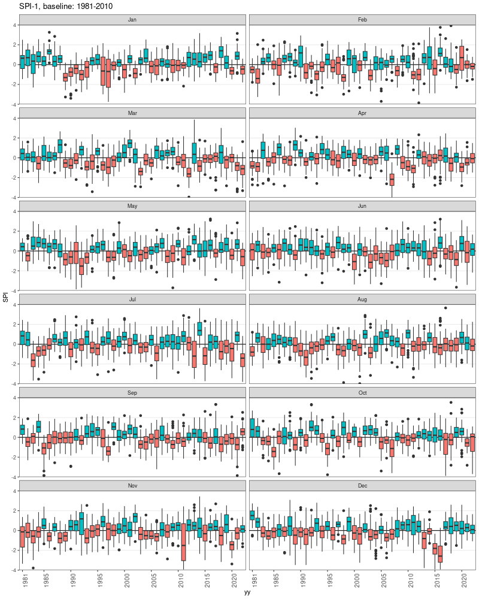

# SPI Annual Distribution

Annual distribution of the SPI. Note, the data series cover the period 1981-2022, but for most of the time series the year 2022 is not complete (data are missing in the last part of the year). For this reason, the analysis covers the periodo 1981-2021.

