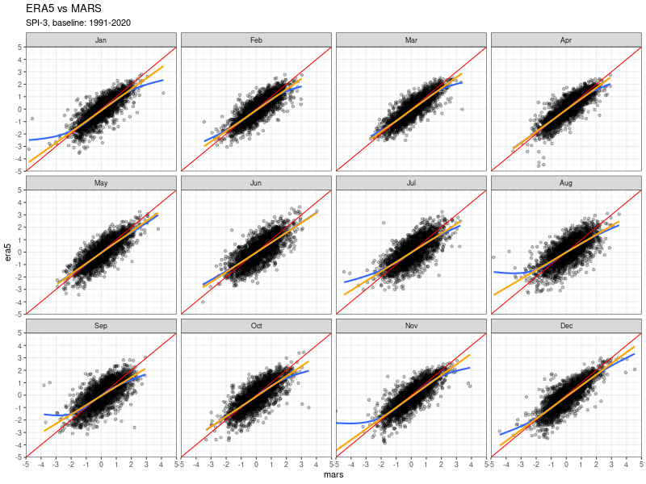

# SPI: Stations vs ERA5

The plots show the scatterplot of the MARS SPI versus the ERA5 SPI. When multiple stations follow in a grid cell, the spi value is averaged.

Note the strange behaviour of some data points in the second scatterplot.

