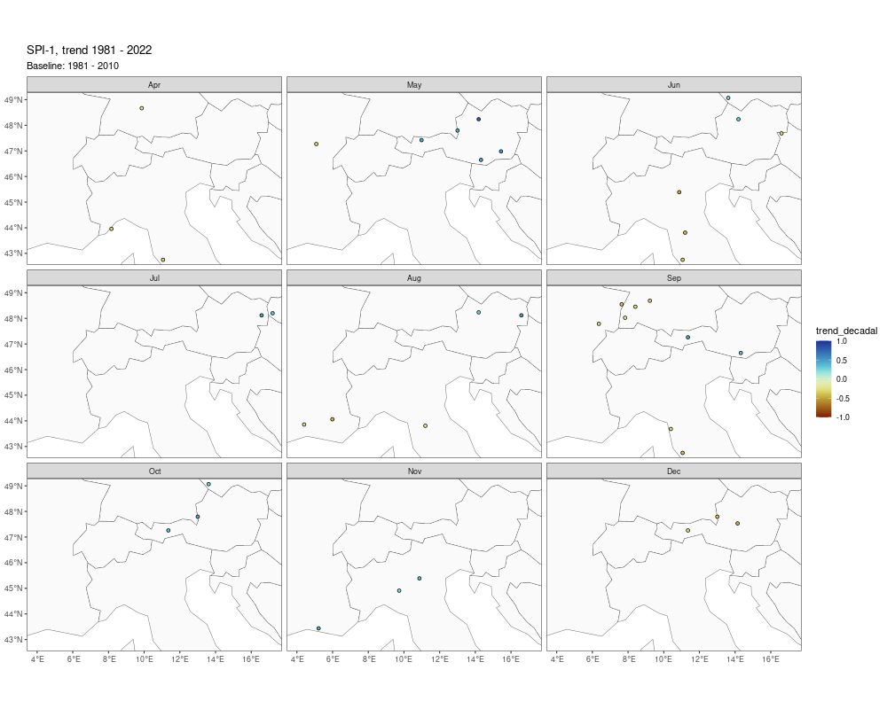

# Trend analysis

The plot shows the series with a signicant trend over the period 1981-2021. The trend is assessed using the Mann-Kendal test, the magnitude of the linear trend is computed throught the Theil-Sen estimator. The analysis is run on the pre-whitened data series.

