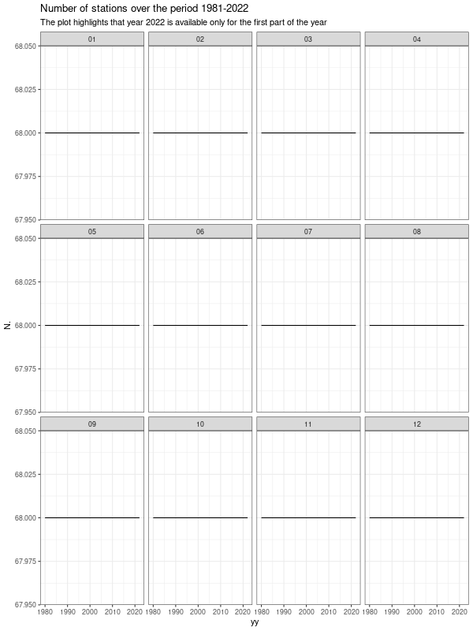

# MARS time series

The time series available in the MARS dataset.

We selected the series for which both the climatological annual values 1981-2010 and 1991-2020 are available (in order to use the most complete series over the period 1981-2020). 

The plot below shows the final selection (65 time series)

## Elevation distribution

Elevation distribution of the selected time series.

## Origin of the input stations

## Number of stations

Evolution in the number of stations. In the previous version of the MARS dataset the year 2022 was characterized by a drop in the number of stations. The latest version solves this issue. No missing data affect sistematically the year 2022. Total number of input stations: 68.

